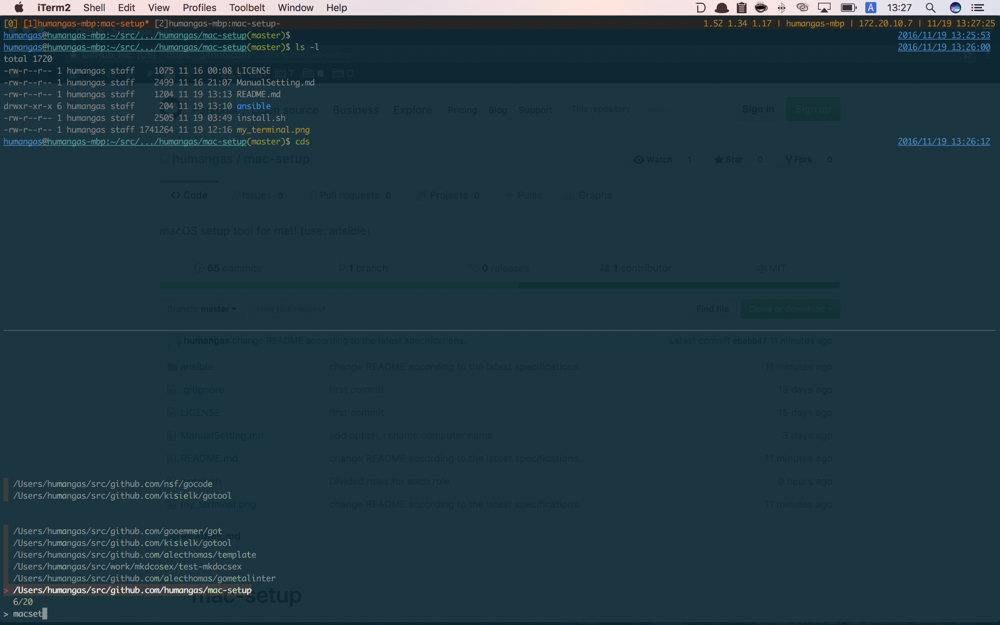
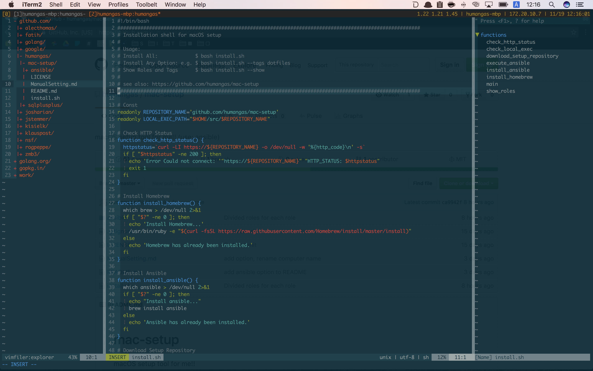

# mac-setup 
macOS setup tool for me!!

# Installation
```
$ curl -L https://raw.githubusercontent.com/humangas/mac-setup/master/install | bash
```

## For local 
```
$ ghq get git@github.com:humangas/mac-setup.git 
$ cd ~/src/github.com/humangas/mac-setup
$ bash install
```

You can also add ansible options to the first argument and beyond. Example see below.
```
$ bash install --tags dotfiles
```

You can check what kind of role is specified by the following command. 
```
$ bash install --show
- { role: homebrew,     tags: ['homebrew'] }
- { role: dirs,         tags: ['dotfiles', 'dirs'] }
- { role: zsh,          tags: ['dotfiles', 'zsh'] }
- { role: ssh,          tags: ['dotfiles', 'ssh'] }
- { role: tmux,         tags: ['dotfiles', 'tmux'] }
- { role: vim,          tags: ['dotfiles', 'vim'] }
- { role: ghq,          tags: ['dotfiles', 'ghq'] }
- { role: macos_dock,   tags: ['macos'   , 'dock'] }
- { role: atom,         tags: ['atom'] }
...
```

# Manual Setting
After completing the installation in the above, make manual setting.
- [Manual Setting](ManualSetting.md)


# After installation 
My terminal display after installation is like this.

## tmux + zsh


## tmux + vim

