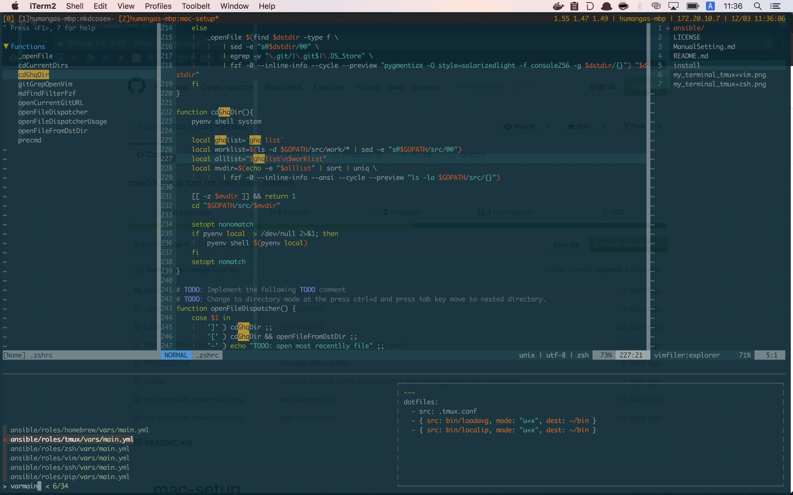

# mac-setup 
[](LICENSE)
[](https://travis-ci.org/humangas/mac-setup)  
macOS setup tool for me. (use: ansible)


# Installation
```
$ curl -L https://raw.githubusercontent.com/humangas/mac-setup/master/install | bash
```

## Local installation
```
$ git clone https://github.com/humangas/mac-setup.git 
$ cd mac-setup 
$ make install
```

You can install it individually by specifying tag.
```
$ make install TAGS=dotfiles
```

With the following command you can see the role and its corresponding tag name.
```
$ make tags
Usage: make install [TAGS=<tag>]

Examples:
 make install TAGS=zsh

- { role: homebrew,     tags: ['homebrew'         ] }
- { role: dirs,         tags: ['dotfiles', 'dirs' ] }
- { role: zsh,          tags: ['dotfiles', 'zsh'  ] }
- { role: tmux,         tags: ['dotfiles', 'tmux' ] }
- { role: vim,          tags: ['dotfiles', 'vim'  ] }
- { role: ssh,          tags: ['dotfiles', 'ssh'  ] }
- { role: go,           tags: ['go'               ] }
- { role: pip,          tags: ['pip'              ] }
- { role: gem,          tags: ['gem'              ] }
- { role: npm,          tags: ['npm'              ] }
- { role: tool_ghq,     tags: ['tool'    , 'ghq'  ] }
- { role: tool_memo,    tags: ['tool'    , 'memo' ] }
- { role: macos_dock,   tags: ['macos'   , 'dock' ] }
...
```


# After installation 
After installation, the terminal will be as follows.

## tmux + zsh + vim + fzf

